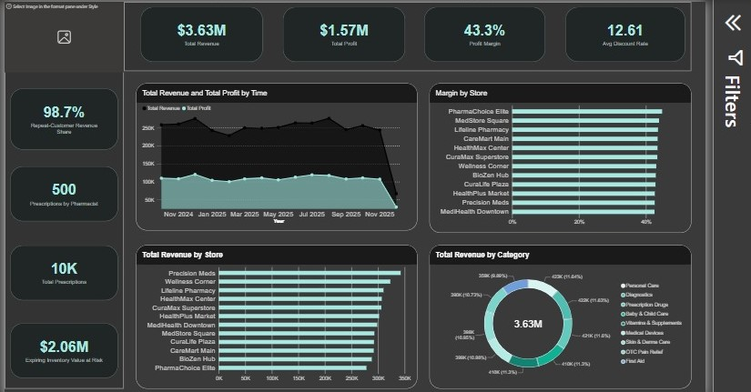

# MeridianHealth Data Analysis Project

## Dashboard Preview

## About

Interactive pharmacy retail and supply chain analysis project focused on sales, profitability, inventory, prescriptions, customers, and staffing.

## Business Questions

* Store profitability after costs and discounts
* Revenue and discount performance by product category
* Inventory value at expiry risk
* Pharmacist staffing vs prescription workload
* Customer segments and payment channel value

## Features

* Revenue & Profit KPIs
* Store Profitability Analysis
* Product & Category Performance
* Inventory Expiry Risk
* Prescription Workload Analysis
* Customer Segmentation
* Payment Channel Analysis
* Interactive Filters & Slicers

## Data Model

* 3 Fact Tables
* 6 Dimension Tables
* Galaxy-Snowflake Schema
* ~10,000 sales records
* ~10,000 prescription records
* ~10,000 inventory records

## Tools

* Microsoft Power BI
* Power Query
* DAX
* Data Modeling
* Data Cleaning
* Data Analysis
